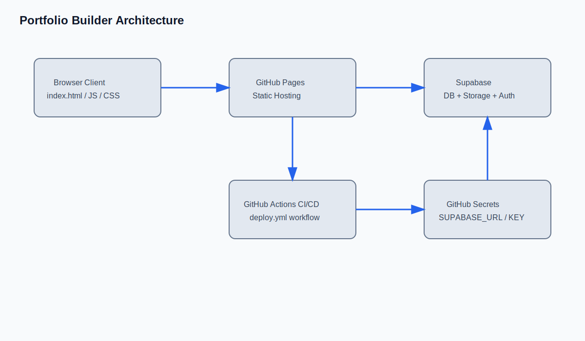
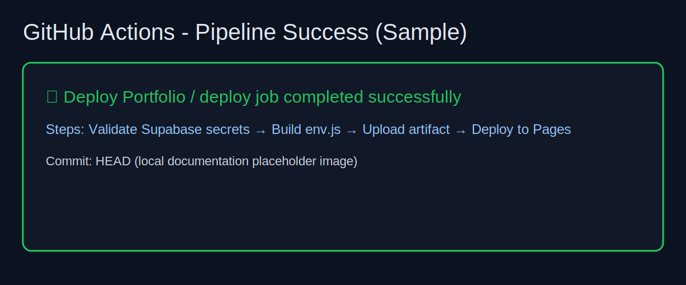
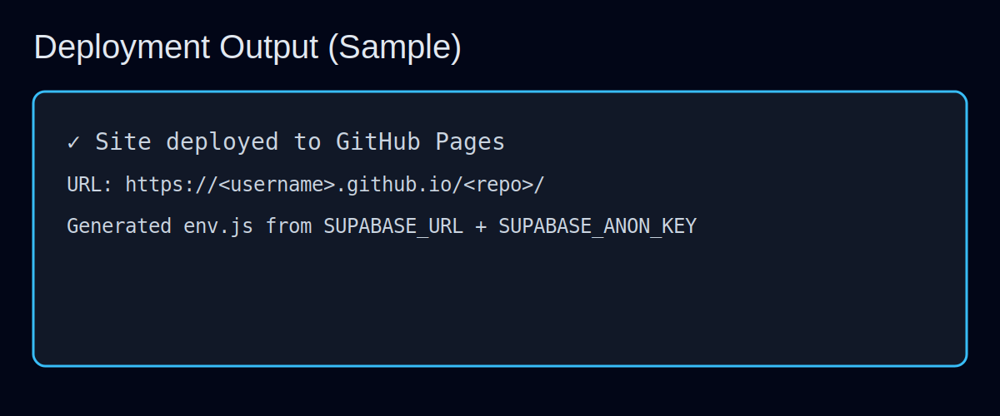

# 1. Project Title
Portfolio Builder with Dynamic Supabase-Powered Portfolio Viewer

# 2. Problem Statement
This project enables users to create and publish portfolio content quickly through a static web interface backed by Supabase. The key problem solved is combining a static frontend deployment (GitHub Pages) with secure runtime configuration for Supabase URL and API key, without hardcoding sensitive values in source code.

# 3. Architecture Diagram (image required)

# 4. CI/CD Pipeline Explanation
The repository uses a GitHub Actions workflow (`.github/workflows/deploy.yml`) to deploy to GitHub Pages.

Pipeline flow:
1. Trigger on push to `main` (or manual dispatch).
2. Validate required secrets:
   - `SUPABASE_ANON_KEY` (required)
   - `SUPABASE_URL` (preferred) or `SUPABASE_URI` (fallback)
3. Validate Supabase URL format (`https://<project-ref>.supabase.co`).
4. Generate `env.js` at deploy time from GitHub Secrets.
5. Upload static artifact and deploy to GitHub Pages.

For Vercel deployments, the app can also read `SUPABASE_URL`/`SUPABASE_ANON_KEY` from `/api/env` (serverless env fallback) when `env.js` is empty.

This approach keeps Supabase configuration outside committed source and fixes mismatches between `SUPABASE_URI` and `SUPABASE_URL` naming.

# 5. Git Workflow Used
- Feature-branch based workflow.
- Local changes committed with a descriptive message.
- CI/CD deploy workflow runs on `main` push.

# 6. Tools Used
- HTML/CSS/Vanilla JavaScript
- Supabase JavaScript SDK
- GitHub Actions
- GitHub Pages
- GitHub Secrets (for runtime Supabase configuration)

# 7. Screenshots:
• Pipeline success

• Deployment output

# 8. Challenges Faced
1. Existing code had a hardcoded Supabase URL and anon key in `portfolio-builder.html`, which is insecure.
2. Secret naming mismatch risk (`SUPABASE_URI` vs `SUPABASE_URL`) could break deployments.
3. Static hosting requires environment injection at deploy time, solved via generated `env.js` in CI.
4. No live CI run artifacts are available in this local environment, so screenshot assets are documentation placeholders.
